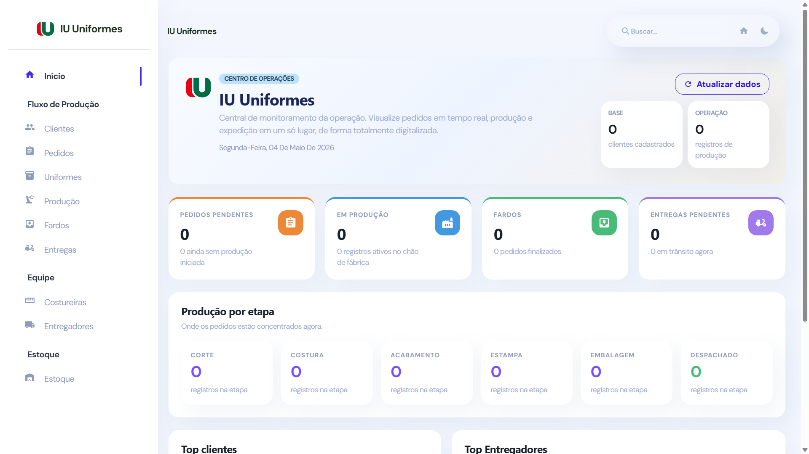
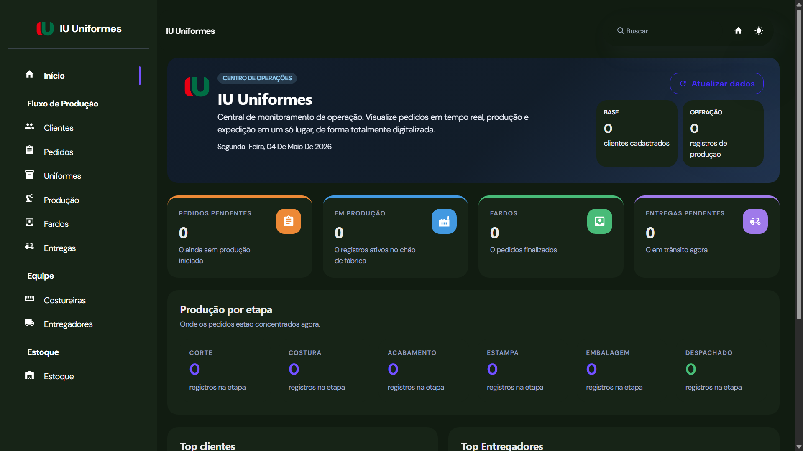

# Sistema de Gestão de Uniformes

Idioma: Português | [English](README.md)

---

## Preview

### Modo Claro

### Modo Escuro

---

## Visão Geral

Sistema web para gerenciar todo o fluxo operacional:

**Pedidos → Produção → Estoque → Entrega**

Centraliza todas as operações da empresa em um só lugar, substituindo planilhas e processos manuais.

---

## Funcionalidades

### Clientes

- Cadastro de clientes com nome e informações de contato

### Uniformes

- Nome
- Tecido: PV ou BRIM
- Tamanho: PP até EXG
- Cor
- Opção de refletivo

### Pedidos

- Criação de pedidos por cliente
- Status do pedido:
  - PENDING
  - IN_PRODUCTION
  - COMPLETED
  - SHIPPED

### Itens do Pedido

- Vinculação de uniformes com quantidades

### Produção

- Atribuição de costureira
- Etapas de produção:
  - CUTTING
  - SEWING
  - PRINTING
  - FINISHING
  - PACKAGING
- Controle de entrada e saída por etapa

### Fardos

- Agrupamento de pedidos concluídos
- Controle da data de envio

### Entrega

- Atribuição de entregador
- Status da entrega:
  - PENDING
  - IN_TRANSIT
  - DELIVERED

### Estoque

- Controle de itens disponíveis
- Vinculação de itens a clientes específicos

---

## Fluxo do Sistema

Cliente → Uniforme → Pedido → Itens → Produção → Fardo → Entrega → Estoque

---

## Vantagens

- Centralização completa da operação
- Rastreabilidade completa
- Redução de erros e retrabalho
- Controle das etapas de produção
- Gestão de equipe
- Estoque organizado
- Acesso remoto pelo navegador

---

## Objetivo

Fornecer visibilidade operacional completa e permitir o crescimento escalável do negócio.
